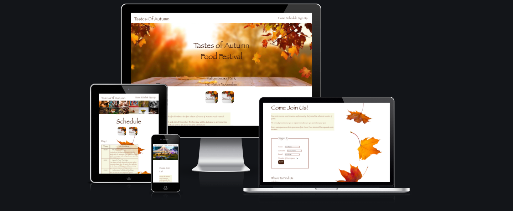

# README

Tastes Of Autumn is an informative website about a food festival taking place in the forest park of Vallombrosa, close to Florence, Tuscany, Italy.  
Using the attractive topic of seasonal food made with organic and autochthonous products, the website aims to attract people to the event to keep alive traditional dishes that are disappearing from our tables, support the local community and strengthen the sense of community; through the narration of folkloristic tales talk about the history of this land, help reduce social isolation in the elderly involving them in some of the activities and finally raise environmental awareness. 
The informal tones used in Tastes Of Autumn want to amuse the users and give an idea of a laid-back environment, making them picture the event as fun, relaxed but still culturally enriching. 
The website targets families of the surrounding areas looking for outdoor activities; people interested in food, nature, and history; and tourists that are after a deeper understanding of the popular culture and a more immersive experience in it. 
The site hopes to give a detailed idea of what the event is about and at the same time stimulate users' curiosity. 

## Features:

### Navigation Bar 
- Featured on all three pages, the full responsive navigation bar includes links to the Logo, Home page, Schedule, and Sign Up page and is identical on each page to allow for easy navigation. 
- This section will allow the user to easily navigate from page to page across all devices without having to revert back to the previous page via the ‘back’ button. 
 
### The landing page image 
- The landing includes a background image with text overlay to allow the user to see the content of the site, the location, and the dates of the event. 
 
### Pages Links section 
 
- This part includes two links to the next pages of the website 
- Due to their central position, size, and different background the links are immediately recognizable allowing the user a more intuitive navigation 
 
 
### Introduction Section 
- The introduction section will allow the user to have a quick view of what the event is about, a short description of the programs for the two days, and the purpose of the event. 
- In this section, the user will see the ethics and perks of the initiative. This should motivate the user to participate in the event. 
 
### The Footer 
- The footer section includes links to the relevant social media sites for Tastes Of Autumn. 
- The links will open to a new tab to allow easy navigation for the user. 
- The footer is valuable to the user as it encourages them to keep connected via social media 
 
### Gallery 
- The gallery will provide the user with supporting images to see what the activities and products look like. 
- This section is valuable to the user as they will be able to easily identify the types of activities they can participate in. 
 
### The Internal Links 
- This section includes two links to the day1 and day2 schedules  
- The user can benefit from these links by minimizing the time that would take scrolling down and viewing promptly the interested timetable 
 
### The Schedule Tables 
- This section includes two tables with the description and times of the activities taking place during the two days 
- The user can now have all the information about the activities of the event and what they involve. 
 
### Image Of The Festival 
- This section will provide the user with a more concrete look at how the Festival looks like 
- This section is valuable to the user as they will be able to easily identify the event once in the area, and it also allows them to have a feel of the festival 

### Requirements 
- This section will inform the user of the requirements to participate in the event  
 
### The Sign Up Form 
 
- This page will allow the user to register to Tastes Of Autumn to make sure to have the access to the event  
- The user will be able to specify the number of participants up to 5 to include other non-computer-literate guests 
- The user will be asked to submit their full name and email address. 
 
### The Map  
- This section will provide the user with the address and a map to get to the event. 
- The user will be able to see the location of the event through the interactive map 
- The user will be able to open the map in a different tab, and have directions. 
 

## Testing:  

- The project has been tested on different browsers to make sure the correct functioning and the results are satisfactory in eather Chrome, Safari, Opera, Firefox  

- I confirm that the site is responsive after going through all the standard portals available in devtools 

- All the links work correctly. The sign-up form requires entries in all fields and the submit button performs correctly  

- All the pages went through Lighthouse in devtools, giving positive results for what concern readability, colour contrast, and accessibility: 

 

### Validator Testing 

- HTML 

No errors were returned when passing through the official W3C validator 

- CSS 

No errors were found when passing through the official (Jigsaw) validator 

 ## Bugs:

 Sometimes, when opening the website on the browser, the footer background image and the main image on the sign-up page wouldn’t load properly. 
- I tried then reducing the size through a compression tool and changed the format from jpg to webp  
- The drastic reduction in size corrected the issue and bettered the performance of the page   

## Deployment

## Credit:

- The information for the content about Vallombrosa arboretum was taken from [Wikipedia](https://it.wikipedia.org/wiki/Arboreto_di_Vallombrosa),  

- Some of the structure and contents for the README.md file [Love Running](https://github.com/Code-Institute-Solutions/readme-template) 
- The link for the attribute ‘action’ for the sign-up form was taken from [Code Institute](https://learn.codeinstitute.net/courses/course-v1:CodeInstitute+LR101+2021_T1/courseware/4a07c57382724cfda5834497317f24d5/4d85cd1a2c57485abbd8ccec8c00732c/?child=last)

### Media 

- The images were taken from 

  * [Pexels](https://www.pexels.com/) 

  * [Shutterstock](https://www.shutterstock.com/) 

  * [Unsplash](https://unsplash.com/) 

  * [Pixabay](https://pixabay.com/) 

- The images were compressed in [Tinyjpg](https://tinyjpg.com/) 

- The images were converted in [Ezgif](https://ezgif.com/jpg-to-webp) 

- The map was taken from [Google maps](https://www.google.com/maps) 

- The screenshot of the website on  different ports was from [Mockup screeen generator](https://ui.dev/amiresponsive) 