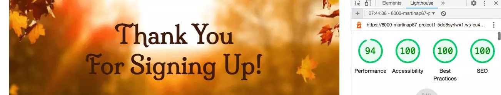

# TASTES OF AUTUMN

[View the live project here](https://martinap87.github.io/Tastes-Of-Autumn)

Tastes Of Autumn is an informative website about a food festival taking place in the forest park of Vallombrosa, close to Florence, Tuscany, Italy.  
The festival centers around seasonal food made with organic and autochthonous products. It aims to keep alive traditional dishes that are disappearing from our tables, support the local community and strengthen the sense of community. It also aims to help reduce social isolation in the elderly by involving them in some of the activities and finally raise environmental awareness. It tries to achieve this by talking about the history of this land with the help of the narration of folkloric tales.
The website's purpose is to attract people to the event.
The informal tones used in Tastes Of Autumn are designed to amuse the users and give a sense of a laid-back environment, making them picture the event as fun, relaxed but still culturally enriching. 
The website targets families of the surrounding areas looking for outdoor activities; people interested in food, nature, and history; and tourists that are looking for a deeper understanding of the popular culture and to be able to be immersed in it. 
The site hopes to give a detailed idea of what the event is about and at the same time stimulate users' curiosity. 

## **Features:**

### Navigation Bar 
- Featured on all three pages, the fully responsive navigation bar includes links to the Logo, Home page, Schedule, and Sign Up page and is identical on each page to allow for easy navigation. 
- This section will allow the user to easily navigate from page to page across all devices without having to revert back to the previous page via the ‘back’ button. 

 
### The Landing Page Image 
- The landing includes a background image with text overlay to allow the user to see the content of the site, the location, and the dates of the event. 

 
### Pages Links Section 
 
- This part includes two links to the next pages of the website.
- Due to their central position, size, and different background the links are immediately recognizable allowing the user more intuitive navigation.

 
 
### Introduction Section 
- The introduction section will allow the user to have a quick overview of what the event is about, see a short description of the program for the two days, and the purpose of the event. 
- In this section, the user will see the ethics and perks of the initiative. This should motivate the user to participate in the event. 

 
### The Footer 
- The footer section includes links to the relevant social media sites for Tastes Of Autumn. 
- The links will open to a new tab to allow easy navigation for the user. 
- The footer is helpful to the user as it encourages them to keep connected via social media.

 
### Gallery 
- The gallery will provide the user with supporting images to see what the activities and products look like. 
- This section is valuable to the user as they will be able to easily identify the types of activities they can participate in. 

 
### The Internal Links 
- This section includes two links to the first and second day schedules.
- The user can benefit from these links by minimizing the time taken in scrolling down and quickly viewing the timetable they are interested in.

 
### The Schedule Tables 
- This section includes two tables with the description and times of the activities taking place during the two days. 
- The user can therefore see all the information about the activities of the event and what they involve.

 
 
### Image Of The Festival 
- This section will provide the user with a more concrete look at how the festival looks.
- This section is valuable to the user as they will be able to easily identify the event once in the area, and it also allows them to get a feel of the festival.

### Requirements 
- This section will inform the user of the requirements to participate in the event. 

 
### The Sign Up Form 
 
- This page will allow the user to register to Tastes Of Autumn to make sure they have access to the event. 
- The user will be able to specify the number of participants (up to 5) to include other non-computer-literate guests.
- The user will be asked to submit their full name and email address. 

 
### The Map  
- This section will provide the user with the address and a map to get to the event. 
- The user will be able to see the location of the event through the interactive map.
- The user will be able to open the map in a different tab, and get directions.

  

 ### The Feedback Section
 - This section will provide the user with a confirmation of the sent form.
 - The user will get feedback that will reassure them of the success of the interaction.

  

 ### The Home Link
 - This section will provide the user with the link to the home page. 
 - The user will be able to proceed to the home page from which to navigate the website to not revert to the previous one. 

  

## **Testing:**  

- The project has been tested on different browsers to make sure the website function correctly and the results are satisfactory in Chrome, Safari, Opera, and Firefox.  

- I can confirm that the site is responsive after going through all the standard portals available in devtools.

-  The sign-up form requires entries in all fields and the submit button performs correctly.

- All the links work correctly.
<table>
<thead>
<tr>
<th>Action</th>
<th>Expected Result</th>
<th>Successful?<th>
</tr>
</thead>
<tbody>
<tr>
<td>Clic on website URL</td>
<td>Open the landing page</td>
<td>Yes</td>
</tr>
<tr>
<td>Clic on Logo</td>
<td>Open the landing page</td>
<td>Yes</td>
</tr>
<tr>
<td>Clic on Home on the navigation bar</td>
<td>Opern the landing page</td>
<td>Yes</td>
</tr>
<tr>
<td>Clic on Schedule on the navigation bar</td>
<td>Go to the schedule page</td>
<td>Yes</td>
</tr>
<tr>
<td>Clic on Sign Up on the navigation bar</td>
<td>Go to the sign up page</td>
<td>Yes</td>
</tr>
<tr>
<td>Clic on the Schedule link on the home page</td>
<td>Go to the schedule page</td>
<td>Yes</td>
</tr>
<tr>
<td>Clic on Sign Up link on the home page</td>
<td>Go to the sign up page</td>
<td>Yes</td>
</tr>
<tr>
<td>Clic on Day 1 in the schedule page</td>
<td>Skip to Day 1 table in the page</td>
<td>Yes</td>
</tr>
<tr>
<td>Clic on Day 2 in the schedule page</td>
<td>Skip to Day 2 table in the page</td>
<td>Yes</td>
</tr>
<tr>
<td>Fill up the sign up form and click the Submit button</td>
<td>Open feedback page</td>
<td>Yes</td>
</tr>
<tr>
<td>Clic on Home link in the feedback page</td>
<td>Go to the landing page</td>
<td>Yes</td>
</tr>
<tr>
<td>Clic on Facebook icon in the footer</td>
<td>Open Facebook in the same tab</td>
<td>Yes</td>
</tr>
<tr>
<td>Clic on Twitter icon in the footer</td>
<td>Open Twitter in the same tab</td>
<td>Yes</td>
</tr>
<tr>
<td>Clic on Instagram icon in the footer</td>
<td>Open Instagram the same tab</td>
<td>Yes</td>
</tr>
</tbody>
</table>

- All the pages went through Lighthouse in devtools, giving positive results for readability, colour contrast, and accessibility: 

 
### Validator Testing 

- HTML 

No errors were returned when passing through the official [W3C validator](https://validator.w3.org/nu/?doc=https%3A%2F%2Fmartinap87.github.io%2FTastes-Of-Autumn%2F)

- CSS 

No errors were found when passing through the official [(Jigsaw) validator](https://jigsaw.w3.org/css-validator/validator?uri=https%3A%2F%2Fmartinap87.github.io%2FTastes-Of-Autumn%2F&profile=css3svg&usermedium=all&warning=1&vextwarning=&lang=en) 

 ## **Bugs:**

 Sometimes, when opening the website on the browser, the footer background image and the main image on the sign-up page wouldn’t load properly. 
- I then tried reducing the size through a compression tool and changed the format from jpg to webp. 
- The drastic size reduction corrected the issue and bettered the performance of the page. 

## **Deployment:** 

The site was deployed to GitHub pages. The steps to deploy are as follows: 
- In the GitHub repository, navigate to the Settings tab;
- On the menu on the left, under Code and Automation, click on Pages;
- From the source section drop-down menu, select the Main Branch;
- Once the main branch has been selected, click on Save;
- At the top of the page will then appear the message “Your site is ready to be published at” and the URL;
- Refresh the page and the message will change to  “Your site is published at” and the active URL.

 **The live link can be found here - https://martinap87.github.io/Tastes-Of-Autumn/**

 ### Local Deployment

To work on the code from a local device, the steps to clone the repository are as follows:
- In the GitHub repository click the Code button, above the list of files;
- Copy the URL displayed on the clone tab;
- Open the terminal on your device;
- type *git clone* and paste the URL copied earleir;
- press enter.

## **Credit:**

- The information for the content about Vallombrosa arboretum was taken from [Wikipedia](https://it.wikipedia.org/wiki/Arboreto_di_Vallombrosa). 

- Some of the structure and contents for the README.md file [Love Running](https://github.com/Code-Institute-Solutions/readme-template).

### Media 

- The images were taken from:

  * [Pexels](https://www.pexels.com/);

  * [Shutterstock](https://www.shutterstock.com/);

  * [Unsplash](https://unsplash.com/);

  * [Pixabay](https://pixabay.com/);

- The images were compressed in [Tinyjpg](https://tinyjpg.com/);

- The images were converted in [Ezgif](https://ezgif.com/jpg-to-webp);

- The map was taken from [Google maps](https://www.google.com/maps);

- The screenshot of the website on  different ports was from [Mockup screen generator](https://ui.dev/amiresponsive). 